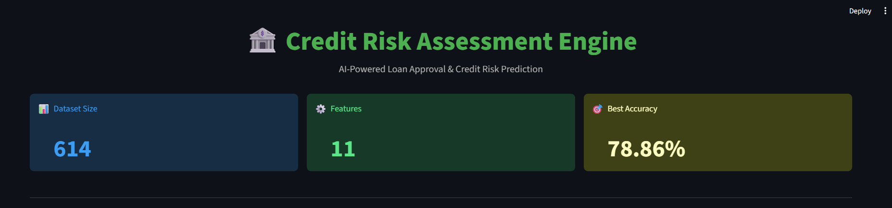
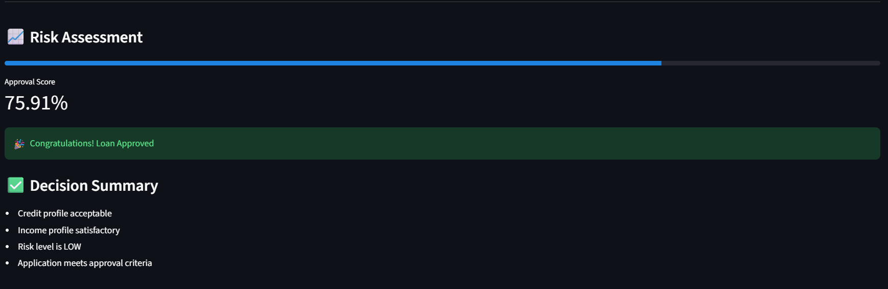
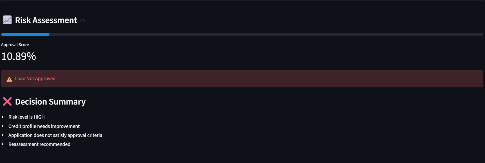

# 🏦 Credit Risk Assessment Engine

An end-to-end Machine Learning application that predicts loan approval based on applicant financial and demographic information.

## Features

- Data preprocessing and cleaning
- Missing value handling
- Feature encoding
- Logistic Regression model training
- Loan approval prediction
- Risk assessment score
- Interactive Streamlit dashboard

## Model Comparison

| Model | Accuracy |
|---------|---------|
| Logistic Regression | 78.86% |
| XGBoost | 77.24% |
| Random Forest | 75.61% |

## Final Model Selection

Logistic Regression was selected as the final model because it achieved the highest test accuracy while remaining lightweight, interpretable, and easy to deploy.

## Tech Stack

- Python
- Pandas
- NumPy
- Scikit-Learn
- Streamlit
- Joblib

## Project Structure

credit-risk-assessment-engine/

├── data/

├── models/

├── notebooks/

├── src/

│ ├── train.py

│ ├── predict.py

│ └── app.py

├── requirements.txt

└── README.md

## How to Run

```bash
pip install -r requirements.txt
streamlit run src/app.py
```

## Results

- Best Accuracy: 78.86%
- Loan Approval Prediction Dashboard
- Real-time Risk Assessment

## Future Improvements

- Hyperparameter tuning
- Additional ML models
- Cloud deployment
- SHAP Explainability

## Application Screenshots

### Dashboard



### Loan Approved



### Loan Rejected

