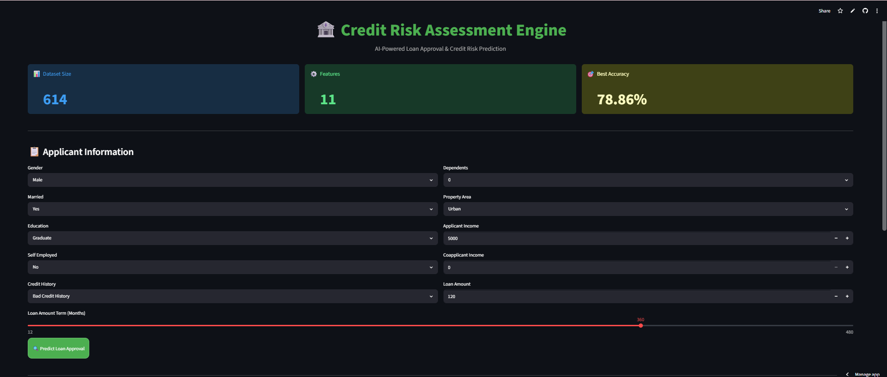

# 🏦 Credit Risk Assessment Engine

[](https://credit-risk-assessment-engine.streamlit.app)
[](https://www.python.org/)
[](https://streamlit.io/)

## Application Preview


## 🌐 Deployment Status

✅ Live on Streamlit Community Cloud

🔗 https://credit-risk-assessment-engine.streamlit.app

AI-powered loan approval and credit risk prediction system built using Machine Learning and deployed on Streamlit Community Cloud.

---

## 🚀 Live Demo

🔗 https://credit-risk-assessment-engine.streamlit.app

---

## 📂 GitHub Repository

🔗 https://github.com/riyaullas/credit-risk-assesment-engine


---

## 📸 Application Screenshots

### Dashboard


### Loan Approved


### Loan Rejected


## Applicant Information Form



---
## 📖 Project Overview

The Credit Risk Assessment Engine predicts whether a loan application is likely to be approved based on applicant demographics, income details, credit history, and loan characteristics.

The system uses a Machine Learning model trained on historical loan application data and provides real-time risk assessment through an interactive Streamlit web application.

---

## ✨ Features

- Real-time loan approval prediction
- Credit risk scoring
- Interactive Streamlit dashboard
- Automated ML inference
- Public cloud deployment
- User-friendly interface

---
## 🏆 Project Highlights

- Built and deployed a production-ready machine learning application.
- Trained and evaluated classification models on 614 loan applications.
- Achieved 78.86% accuracy and 98.75% recall.
- Deployed publicly using Streamlit Community Cloud with GitHub-based CI/CD.
- Designed an interactive dashboard for real-time credit risk assessment.

---

## 🛠 Tech Stack

### Languages & Libraries

- Python
- Pandas
- NumPy
- Scikit-Learn
- Streamlit
- Joblib

### Machine Learning

- Logistic Regression
- Classification Modeling
- Data Preprocessing
- Feature Engineering

---

## 📊 Model Performance

| Metric | Value |
|----------|----------|
| Algorithm | Logistic Regression |
| Dataset Size | 614 Applications |
| Features | 11 |
| Accuracy | 78.86% |
| Precision | 75.96% |
| Recall | 98.75% |
| F1 Score | 85.87% |

### Key Insights

- Achieved **78.86% classification accuracy** on 614 loan applications.
- High **Recall (98.75%)** minimizes the risk of missing eligible loan applicants.
- **F1 Score of 85.87%** demonstrates a strong balance between precision and recall.
- Model provides fast and reliable predictions suitable for real-time decision support.

---

## 💼 Business Impact

This project demonstrates how machine learning can assist financial institutions in evaluating loan applications by estimating credit risk and identifying applicants with a high likelihood of approval.

The solution helps automate decision-making, reduce manual effort, and improve consistency in loan approval workflows.

---

## 🔍 Model Comparison

| Model | Accuracy |
|---------|---------|
| Logistic Regression | 78.86% |
| XGBoost | 77.24% |
| Random Forest | 75.61% |

---

## ✅ Final Model Selection

Logistic Regression was selected as the production model after evaluating multiple classification algorithms. It achieved the highest test accuracy (78.86%) while offering low inference latency, interpretability, and lightweight deployment suitability.

---

## 📁 Project Structure

```text
credit-risk-assesment-engine/

├── data/
│   └── raw/
│
├── models/
│   ├── loan_approval_model.pkl
│   └── label_encoder.pkl
│
├── notebooks/
│
├── reports/
│
├── screenshots/
│
├── src/
│   ├── app.py
│   ├── train.py
│   ├── predict.py
│   └── __init__.py
│
├── requirements.txt
└── README.md
```

---

## ⚙️ Installation

Clone the repository:

```bash
git clone https://github.com/riyaullas/credit-risk-assesment-engine.git
cd credit-risk-assesment-engine
```

Install dependencies:

```bash
pip install -r requirements.txt
```

Run the Streamlit application:

```bash
streamlit run src/app.py
```

---

## 🎯 Results
- Publicly deployed ML application accessible via web browser
- Successfully deployed on Streamlit Community Cloud
- Achieved 78.86% prediction accuracy
- Achieved 98.75% recall on loan approval classification
- Provides real-time loan approval prediction
- Generates instant credit risk assessment scores
- Supports interactive user input through a web dashboard

---

## ☁️ Deployment

The application is deployed on Streamlit Community Cloud and automatically updates whenever new changes are pushed to GitHub.

### Live Application

🔗 https://credit-risk-assessment-engine.streamlit.app

---

## 🚀 Future Improvements

- Hyperparameter optimization using GridSearchCV
- SHAP-based model explainability
- PDF credit risk reports
- User authentication and role management
- Integration with FastAPI backend services
- Docker containerization

---

## 👨‍💻 Author

**Riya Ullas**

- GitHub: https://github.com/riyaullas
- Live Demo: https://credit-risk-assessment-engine.streamlit.app
⭐ If you found this project useful, consider giving it a star on GitHub.